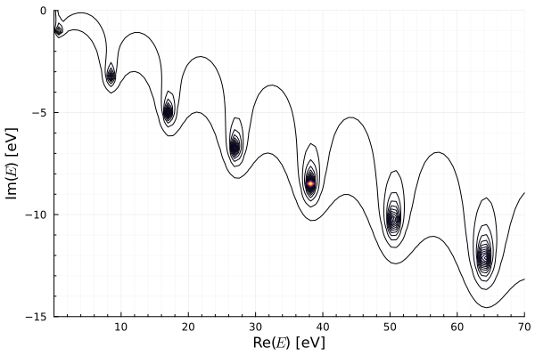

# Numerical computation of 1D Scheodinger equation

## Introduction
In this lecture, we will show you how to solve a Schrodinger equation with numerical method. We will deal with two problems, one for binding state, another for scattering. The potential we adopt is finite potential well.

Instead of working with differential form of Schrödinger equation, we use the integral form [[1]](#id1), namely,

$$
\psi(\vec{x}) = \phi_k(\vec{x}) - \frac{m}{2\pi} \int \mathrm{d}\vec{r'} \frac{e^{ik|\vec{r}-\vec{r'}|}}{|\vec{r}-\vec{r'}|}V(\vec{r})\psi(\vec{r'}).
$$

However, in this lecture, we focus on one-dimensional Schrödinger equation . For the one-dimensional case, the eqaution is [[2]](#id2)

$$
    \psi(x) = \phi_k(x) - \frac{im}{k} \int \mathrm{d}x e^{ik|x-x'|} V(x')\psi(x') .
$$

we approximate the integral part of this eqaution by some numerical integration methods. Here the gaussian quadrature is employed, i.e.,

$$
\int_a^b \mathrm{d}x f(x) \approx \sum_i^N f(x_i) w_i,
$$

where $x_i$ and $w_i$ are integration points and weights, respectively. with the help of this formula, we rewrite the eqaution as follows:

$$
    \psi(x) \approx \phi_k(x) + \frac{-im}{k} \sum_j^N\left( e^{ik|x-x_j|} V(x_j) \psi(x_j) \right)w_j. 
$$

To implement a numerical calculation, the position $x$ will be discretized to a set of values $x_i$. These points also are chosen to be same integration points. This leads to a set of $N$ coupled equations in $N$ unknowns(if the question is about binding state, we will have $N+1$ unkowns), i.e.,

$$
    \psi(x_i) \approx \phi(x_i) + \frac{-im}{k}  \sum_j^N\left( e^{ik|x_i-x_j|} V(x_j) \psi(x_j) \right)w_j\ (x_i=1,\ 2,\ 3,\cdots,\ N).
$$

As a concrete example, for $N=2$, we have two simultaneous linear equations, namely,

$$
\begin{aligned}
   \psi(x_1) &= \phi(x_1) + \frac{-im}{k}  \left( e^{ik|x_1-x_1|} V(x_1) \psi(x_1) + e^{ik|x_1-x_2|} V(x_2) \psi(x_2) \right) \\
   \psi(x_2) &= \phi(x_2) + \frac{-im}{k}  \left( e^{ik|x_2-x_1|} V(x_1) \psi(x_1) + e^{ik|x_2-x_2|} V(x_2) \psi(x_2) \right),
\end{aligned}
$$

where we replaced $\approx$ with $=$. The above equations can be rewriten with matrix form, i.e,

$$
\begin{bmatrix}
    \psi(x_1) \\
    \psi(x_2)
\end{bmatrix}=
\begin{bmatrix}
    \phi(x_1) \\
    \phi(x_2)
\end{bmatrix}
+
\begin{bmatrix}
G_{11} & G_{12} \\
G_{21} & G_{22} 
\end{bmatrix}
\begin{bmatrix} 
    V(x_1) & 0 \\
    0 & V(x_2)
\end{bmatrix}
\begin{bmatrix}
    w_1 & 0\\
    0 & w_2
\end{bmatrix}
\begin{bmatrix}
\psi(x_1) \\
\psi(x_2)
\end{bmatrix}
$$

We define $D=GVW$, where $G$, $V$, and $W$ stand for Green function, potential, and weight, respectively. for $N$ coupled linear equations, we write it as matrix form, i.e.,

$$
    (I-D)[\psi] = [\phi].
$$

The formal soulation for this requation can be expressed as 

$$
    [\psi] = (I-D)^{-1} [\phi].
$$

The ground state energies and resonace energies as ploes can be determined by $\det(I-D)=0$. we get these poles at next two sections.

## Ground state

For bound state, the energy $E$ is less than 0. In order to see the positions of poles, we plot $\det(I-D)$ at energy range $(-20, 0)$ eV. Interestingly, for $E<0$, the $\det(I-D)$'s are real. The figure is shown following.

From the figure, we can see that there are 6 zeros of $\det(I-D)$. The exact values of them are shown as follows.

| gs       |
|----------|
| $-3.55$  |
| $-8.32$  |
| $-12.44$ |
| $-15.71$ |
| $-18.0$  |
| $-19.59$ |

## Resonance state

For resonance state, the pole will have a imaginary part. we let $|1/\det(I-D)|$ be $z$ axis. Then we plot the contour of $|\det(I-D)|$, which is shown as follows.

There are 7 poles from the figure. The values of them  are list in the table.

| Resonance      |
|----------------|
| $64.01-12.15i$ |
| $50.5-10.3i$   |
| $38.17-8.5i$   |
| $27.04-6.74i$  |
| $17.1-5.0i$    |
| $8.34-3.24i$   |
| $0.78-1.01i$   |

- [1] [Griffiths, David J., and Darrell F. Schroeter. Introduction to quantum mechanics. Cambridge university press, 2018](https://ia904607.us.archive.org/3/items/introduction-to-solid-state-physics-by-charles-kittel-urdukutabkhanapk.blogspot.com/Uploaded%20-%2031-03-2021/Physics%20%286%29-21-3-2021/Introduction%20to%20Quantum%20Mechanics%20by%20David%20J.%20Griffiths%20And%20Darrell%20F.%20Schroeter%20_%28urdukutabkhanapk.blogspot.com%29.pdf)

- [2] [Green's function for one dimensional Schrödinger equation](http://physicspages.com/pdf/Quantum%20mechanics/Green%27s%20function%20for%20one%20dimensional%20Schr%C3%B6dinger%20equation.pdf)

- [3] [Hirtler, Dominic. Quantum Mechanical Scattering at Arbitrary Potentials in 1 and 2 Dimensions by Numerically Solving the Lippmann-Schwinger Equation. Diss. Institute of Physics, 2019](https://static.uni-graz.at/fileadmin/_Persoenliche_Webseite/puschnig_peter/unigrazform/Theses/Hirtler_Bachelorarbeit_final.pdf)
